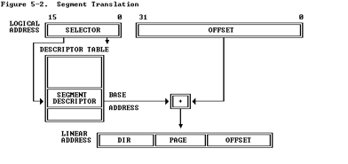
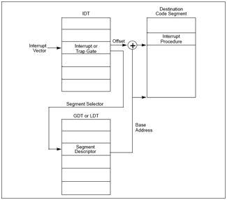
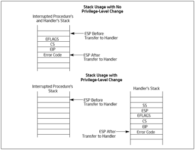

# 实验一：系统软件启动过程
## 1.实验目的：

操作系统是一个软件，也需要通过某种机制加载并运行它。在这里我们将通过另外一个更加简单的软件-bootloader来完成这些工作。为此，我们需要完成一个能够切换到x86的保护模式并显示字符的bootloader，为启动操作系统ucore做准备。lab1提供了一个非常小的bootloader和ucore OS，整个bootloader执行代码小于512个字节，这样才能放到硬盘的主引导扇区中。通过分析和实现这个bootloader和ucore OS，读者可以了解到：

- 基于分段机制的存储管理
- 设备管理的基本概念
- PC启动bootloader的过程
- bootloader的文件组成
- 编译运行bootloader的过程
- 调试bootloader的方法
- ucore OS的启动过程
- 在汇编级了解栈的结构和处理过程
- 中断处理机制
- 通过串口/并口/CGA输出字符的方法
 
## 2.实验内容：

lab1中包含一个bootloader和一个OS。这个bootloader可以切换到X86保护模式，能够读磁盘并加载ELF执行文件格式，并显示字符。而这lab1中的OS只是一个可以处理时钟中断和显示字符的幼儿园级别OS。

### 2.1 练习

#### 练习1：理解通过make生成执行文件的过程。（要求在报告中写出对下述问题的回答）

在此练习中，大家需要通过静态分析代码来了解：

1. 操作系统镜像文件ucore.img是如何一步一步生成的？(需要比较详细地解释Makefile中每一条相关命令和命令参数的含义，以及说明命令导致的结果)
2. 一个被系统认为是符合规范的硬盘主引导扇区的特征是什么？

补充材料：

如何调试Makefile

当执行make时，一般只会显示输出，不会显示make到底执行了哪些命令。

如想了解make执行了哪些命令，可以执行：

	$ make "V="

要获取更多有关make的信息，可上网查询，并请执行

	$ man make
 
#### 练习2：使用qemu执行并调试lab1中的软件。（要求在报告中简要写出练习过程）

为了熟悉使用qemu和gdb进行的调试工作，我们进行如下的小练习：

1. 从CPU加电后执行的第一条指令开始，单步跟踪BIOS的执行。 
2. 在初始化位置0x7c00设置实地址断点,测试断点正常。
3. 从0x7c00开始跟踪代码运行,将单步跟踪反汇编得到的代码与bootasm.S和 bootblock.asm进行比较。
4. 自己找一个bootloader或内核中的代码位置，设置断点并进行测试。 
 
提示：参考附录“启动后第一条执行的指令”

补充材料：
我们主要通过硬件模拟器qemu来进行各种实验。在实验的过程中我们可能会遇上各种各样的问题，调试是必要的。qemu支持使用gdb进行的强大而方便的调试。所以用好qemu和gdb是完成各种实验的基本要素。

默认的gdb需要进行一些额外的配置才进行qemu的调试任务。qemu和gdb之间使用网络端口1234进行通讯。在打开qemu进行模拟之后，执行gdb并输入

	target remote localhost:1234

即可连接qemu，此时qemu会进入停止状态，听从gdb的命令。

另外，我们可能需要qemu在一开始便进入等待模式，则我们不再使用make qemu开始系统的运行，而使用make debug来完成这项工作。这样qemu便不会在gdb尚未连接的时候擅自运行了。
 
***gdb的地址断点***

在gdb命令行中，使用b *[地址]便可以在指定内存地址设置断点，当qemu中的cpu执行到指定地址时，便会将控制权交给gdb。
 
***关于代码的反汇编***

有可能gdb无法正确获取当前qemu执行的汇编指令，通过如下配置可以在每次gdb命令行前强制反汇编当前的指令，在gdb命令行或配置文件中添加：

	define hook-stop
	x/i $pc
	end

即可
 
***gdb的单步命令***

在gdb中，有next, nexti, step, stepi等指令来单步调试程序，他们功能各不相同，区别在于单步的“跨度”上。

	next 单步到程序源代码的下一行，不进入函数。
	nexti 单步一条机器指令，不进入函数。
	step 单步到下一个不同的源代码行（包括进入函数）。
	stepi 单步一条机器指令。
 
#### 练习3：分析bootloader进入保护模式的过程。（要求在报告中写出分析）

BIOS将通过读取硬盘主引导扇区到内存，并转跳到对应内存中的位置执行bootloader。请分析bootloader是如何完成从实模式进入保护模式的。

提示：需要阅读3.2.1小节“保护模式和分段机制”和lab1/boot/bootasm.S源码，了解如何从实模式切换到保护模式。 

#### 练习4：分析bootloader加载ELF格式的OS的过程。（要求在报告中写出分析）

通过阅读bootmain.c，了解bootloader如何加载ELF文件。通过分析源代码和通过qemu来运行并调试bootloader&OS，

1. bootloader如何读取硬盘扇区的？
2. bootloader是如何加载ELF格式的OS？

提示：可阅读3.2.3“硬盘访问概述”，3.2.4“ELF执行文件格式概述”。

#### 练习5：实现函数调用堆栈跟踪函数 （需要编程）

我们需要在lab1中完成kdebug.c中函数print_stackframe的实现，可以通过函数print_stackframe来跟踪函数调用堆栈中记录的返回地址。在如果能够正确实现此函数，可在lab1中执行 “make qemu”后，在qemu模拟器中得到类似如下的输出：

	……
	ebp:0x00007b28 eip:0x00100992 args:0x00010094 0x00010094 0x00007b58 0x00100096 
	    kern/debug/kdebug.c:305: print_stackframe+22
	ebp:0x00007b38 eip:0x00100c79 args:0x00000000 0x00000000 0x00000000 0x00007ba8 
	    kern/debug/kmonitor.c:125: mon_backtrace+10
	ebp:0x00007b58 eip:0x00100096 args:0x00000000 0x00007b80 0xffff0000 0x00007b84 
	    kern/init/init.c:48: grade_backtrace2+33
	ebp:0x00007b78 eip:0x001000bf args:0x00000000 0xffff0000 0x00007ba4 0x00000029 
	    kern/init/init.c:53: grade_backtrace1+38
	ebp:0x00007b98 eip:0x001000dd args:0x00000000 0x00100000 0xffff0000 0x0000001d 
	    kern/init/init.c:58: grade_backtrace0+23
	ebp:0x00007bb8 eip:0x00100102 args:0x0010353c 0x00103520 0x00001308 0x00000000 
	    kern/init/init.c:63: grade_backtrace+34
	ebp:0x00007be8 eip:0x00100059 args:0x00000000 0x00000000 0x00000000 0x00007c53 
	    kern/init/init.c:28: kern_init+88
	ebp:0x00007bf8 eip:0x00007d73 args:0xc031fcfa 0xc08ed88e 0x64e4d08e 0xfa7502a8 
	<unknow>: -- 0x00007d72 –
	……

请完成实验，看看输出是否与上述显示大致一致，并解释最后一行各个数值的含义。

提示：可阅读3.3.1小节“函数堆栈”，了解编译器如何建立函数调用关系的。在完成lab1编译后，查看lab1/obj/bootblock.asm，了解bootloader源码与机器码的语句和地址等的对应关系；查看lab1/obj/kernel.asm，了解
ucore OS源码与机器码的语句和地址等的对应关系。

要求完成函数kern/debug/kdebug.c::print_stackframe的实现，提交改进后源代码包（可以编译执行），并在实验报告中简要说明实现过程，并写出对上述问题的回答。
 
补充材料：

由于显示完整的栈结构需要解析内核文件中的调试符号，较为复杂和繁琐。代码中有一些辅助函数可以使用。例如可以通过调用print_debuginfo函数完成查找对应函数名并打印至屏幕的功能。具体可以参见kdebug.c代码中的注释。

#### 练习6：完善中断初始化和处理 （需要编程）

请完成编码工作和回答如下问题：

1. 中断向量表中一个表项占多少字节？其中哪几位代表中断处理代码的入口？
2. 请编程完善kern/trap/trap.c中对中断向量表进行初始化的函数idt_init。在idt_init函数中，依次对所有中断入口进行初始化。使用mmu.h中的SETGATE宏，填充idt数组内容。注意除了系统调用中断(T_SYSCALL)以外，其它中断均使用中断门描述符，权限为内核态权限；而系统调用中断使用异常，权限为陷阱门描述符。每个中断的入口由tools/vectors.c生成，使用trap.c中声明的vectors数组即可。
3. 请编程完善trap.c中的中断处理函数trap，在对时钟中断进行处理的部分填写trap函数中处理时钟中断的部分，使操作系统每遇到100次时钟中断后，调用print_ticks子程序，向屏幕上打印一行文字”100 ticks”。

要求完成问题2和问题3 提出的相关函数实现，提交改进后的源代码包（可以编译执行），并在实验报告中简要说明实现过程，并写出对问题1的回答。完成这问题2和3要求的部分代码后，运行整个系统，可以看到大约每1秒会输出一次”100 ticks”，而按下的键也会在屏幕上显示。

提示：可阅读3.3.2小节“中断与异常”。
 
#### 扩展练习 Challenge（需要编程）

扩展proj4,增加syscall功能，即增加一用户态函数（可执行一特定系统调用：获得时钟计数值），当内核初始完毕后，可从内核态返回到用户态的函数，而用户态的函数又通过系统调用得到内核态的服务（通过网络查询所需信息，可找老师咨询。如果完成，且有兴趣做代替考试的实验，可找老师商量）。需写出详细的设计和分析报告。完成出色的可获得适当加分。
 
提示：
规范一下 challenge 的流程。
 
kern_init 调用 switch_test，该函数如下：
 
	static void
	switch_test(void) {
		print_cur_status();          // print 当前 cs/ss/ds 等寄存器状态
		cprintf("+++ switch to  user  mode +++\n");
		switch_to_user();            // switch to user mode
		print_cur_status();
		cprintf("+++ switch to kernel mode +++\n");
		switch_to_kernel();         // switch to kernel mode
		print_cur_status();
	}
 
switch_to_\* 函数建议通过 中断处理的方式实现。主要要完成的代码是在 trap 里面处理 T_SWITCH_TO\* 中断，并设置好返回的状态。
 
在 lab1 里面完成代码以后，执行 make grade 应该能够评测结果是否正确。

### 2.2 项目组成

lab1的整体目录结构如下所示：

```
.
├── boot
│   ├── asm.h
│   ├── bootasm.S
│   └── bootmain.c
├── kern
│   ├── debug
│   │   ├── assert.h
│   │   ├── kdebug.c
│   │   ├── kdebug.h
│   │   ├── kmonitor.c
│   │   ├── kmonitor.h
│   │   ├── panic.c
│   │   └── stab.h
│   ├── driver
│   │   ├── clock.c
│   │   ├── clock.h
│   │   ├── console.c
│   │   ├── console.h
│   │   ├── intr.c
│   │   ├── intr.h
│   │   ├── kbdreg.h
│   │   ├── picirq.c
│   │   └── picirq.h
│   ├── init
│   │   └── init.c
│   ├── libs
│   │   ├── readline.c
│   │   └── stdio.c
│   ├── mm
│   │   ├── memlayout.h
│   │   ├── mmu.h
│   │   ├── pmm.c
│   │   └── pmm.h
│   └── trap
│       ├── trap.c
│       ├── trapentry.S
│       ├── trap.h
│       └── vectors.S
├── libs
│   ├── defs.h
│   ├── elf.h
│   ├── error.h
│   ├── printfmt.c
│   ├── stdarg.h
│   ├── stdio.h
│   ├── string.c
│   ├── string.h
│   └── x86.h
├── Makefile
└── tools
    ├── function.mk
    ├── gdbinit
    ├── grade.sh
    ├── kernel.ld
    ├── sign.c
    └── vector.c

10 directories, 48 files
```
 
其中一些比较重要的文件说明如下：

***bootloader部分***
- boot/bootasm.S ：定义并实现了bootloader最先执行的函数start，此函数进行了一定的初始化，完成了从实模式到保护模式的转换，并调用bootmain.c中的bootmain函数。
- boot/bootmain.c：定义并实现了bootmain函数实现了通过屏幕、串口和并口显示字符串。bootmain函数加载ucore操作系统到内存，然后跳转到ucore的入口处执行。
- boot/asm.h：是bootasm.S汇编文件所需要的头文件，主要是一些与X86保护模式的段访问方式相关的宏定义。

***ucore操作系统部分***

系统初始化部分：

- kern/init/init.c：ucore操作系统的初始化启动代码

内存管理部分：
- kern/mm/memlayout.h：ucore操作系统有关段管理（段描述符编号、段号等）的一些宏定义
- kern/mm/mmu.h：ucore操作系统有关X86 MMU等硬件相关的定义，包括EFLAGS寄存器中各位的含义，应用/系统段类型，中断门描述符定义，段描述符定义，任务状态段定义，NULL段声明的宏SEG_NULL, 特定段声明的宏SEG，设置中
断门描述符的宏SETGATE（在练习6中会用到）
- kern/mm/pmm.[ch]：设定了ucore操作系统在段机制中要用到的全局变量：任务状态段ts，全局描述符表 gdt[]，加载全局描述符表寄存器的函数lgdt，临时的内核栈stack0；以及对全局描述符表和任务状态段的初始化函数gdt_init

外设驱动部分：

- kern/driver/intr.[ch]：实现了通过设置CPU的eflags来屏蔽和使能中断的函数；
- kern/driver/picirq.[ch]：实现了对中断控制器8259A的初始化和使能操作；
- kern/driver/clock.[ch]：实现了对时钟控制器8253的初始化操作；- kern/driver/console.[ch]：实现了对串口和键盘的中断方式的处理操作；

中断处理部分：

- kern/trap/vectors.S：包括256个中断服务例程的入口地址和第一步初步处理实现。注意，此文件是由tools/vector.c在编译ucore期间动态生成的；
- kern/trap/trapentry.S：紧接着第一步初步处理后，进一步完成第二步初步处理；并且有恢复中断上下文的处理，即中断处理完毕后的返回准备工作；
- kern/trap/trap.[ch]：紧接着第二步初步处理后，继续完成具体的各种中断处理操作；

内核调试部分：

- kern/debug/kdebug.[ch]：提供源码和二进制对应关系的查询功能，用于显示调用栈关系。其中补全print_stackframe函数是需要完成的练习。其他实现部分不必深究。
- kern/debug/kmonitor.[ch]：实现提供动态分析命令的kernel monitor，便于在ucore出现bug或问题后，能够进入kernel monitor中，查看当前调用关系。实现部分不必深究。
- kern/debug/panic.c | assert.h：提供了panic函数和assert宏，便于在发现错误后，调用kernel monitor。大家可在编程实验中充分利用assert宏和panic函数，提高查找错误的效率。

***公共库部分***
- libs/defs.h：包含一些无符号整型的缩写定义。
- Libs/x86.h：一些用GNU C嵌入式汇编实现的C函数（由于使用了inline关键字，所以可以理解为宏）。

***工具部分***
- Makefile和function.mk：指导make完成整个软件项目的编译，清除等工作。
- sign.c：一个C语言小程序，是辅助工具，用于生成一个符合规范的硬盘主引导扇区。
- tools/vector.c：生成vectors.S，此文件包含了中断向量处理的统一实现。
 
编译方法

首先下载lab1.tar.bz2，然后解压lab1.tar.bz2。在lab1目录下执行make，可以生成ucore.img（生成于bin目录下）。ucore.img是一个包含了bootloader或OS的硬盘镜像，通过执行如下命令可在硬件虚拟环境 qemu中运行bootloader或OS：

	$ make qemu
    
## 3  从机器启动到操作系统运行的过程

### 3.1 BIOS启动过程

当计算机加电后，一般不直接执行操作系统，而是执行系统初始化软件完成基本IO初始化和引导加载功能。简单地说，系统初始化软件就是在操作系统内核运行之前运行的一段小软件。通过这段小软件，我们可以初始化硬件设备、建立系统的内存空间映射图，从而将系统的软硬件环境带到一个合适的状态，以便为最终调用操作系统内核准备好正确的环境。最终引导加载程序把操作系统内核映像加载到RAM中，并将系统控制权传递给它。 

对于绝大多数计算机系统而言，操作系统和应用软件是存放在磁盘（硬盘/软盘）、光盘、EPROM、ROM、Flash等可在掉电后继续保存数据的存储介质上。计算机启动后，CPU一开始会到一个特定的地址开始执行指令，这个特定的地址存放了系统初始化软件，负责完成计算机基本的IO初始化，这是系统加电后运行的第一段软件代码。对于Intel 80386的体系结构而言，PC机中的系统初始化软件由BIOS (Basic Input Output System，即基本输入/输出系统，其本质是一个固化在主板Flash/CMOS上的软件)和位于软盘/硬盘引导扇区中的OS Boot Loader（在ucore中的bootasm.S和bootmain.c）一起组成。BIOS实际上是被固化在计算机ROM（只读存储器）芯片上的一个特殊的软件，为上层软件提供最底层的、最直接的硬件控制与支持。更形象地说，BIOS就是PC计算机硬件与上层软件程序之间的一个"桥梁"，负责访问和控制硬件。 

以Intel 80386为例，计算机加电后，CPU从物理地址0xFFFFFFF0（由初始化的CS：EIP确定，此时CS和IP的值分别是0xF000和0xFFF0)）开始执行。在0xFFFFFFF0这里只是存放了一条跳转指令，通过跳转指令跳到BIOS例行程序起始点。BIOS做完计算机硬件自检和初始化后，会选择一个启动设备（例如软盘、硬盘、光盘等），并且读取该设备的第一扇区(即主引导扇区或启动扇区)到内存一个特定的地址0x7c00处，然后CPU控制权会转移到那个地址继续执行。至此BIOS的初始化工作做完了，进一步的工作交给了ucore的bootloader。 

### 3.2  bootloader启动过程

BIOS将通过读取硬盘主引导扇区到内存，并转跳到对应内存中的位置执行bootloader。bootloader完成的工作包括：
- 切换到保护模式，启用分段机制
- 读磁盘中ELF执行文件格式的ucore操作系统到内存
- 显示字符串信息
- 把控制权交给ucore操作系统

对应其工作的实现文件在lab1中的boot目录下的三个文件asm.h、bootasm.S和bootmain.c。下面从原理上介绍完成上述工作的计算机系统硬件和软件背景知识。

#### 3.2.1 保护模式和分段机制

为何要了解Intel 80386的保护模式和分段机制？首先，我们知道Intel 80386只有在进入保护模式后，才能充分发挥其强大的功能，提供更好的保护机制和更大的寻址空间，否则仅仅是一个快速的8086而已。没有一定的保护机制，任何一个应用软件都可以任意访问所有的计算机资源，这样也就无从谈起操作系统设计了。且Intel 80386的分段机制一直存在，无法屏蔽或避免。其次，在我们的bootloader设计中，涉及到了从实模式到保护模式的处理，我们的操作系统功能（比如分页机制）是建立在Intel 80386的保护模式上来设计的。如果我们不了解保护模式和分段机制，则我们面向Intel 80386体系结构的操作系统设计实际上是建立在一个空中楼阁之上。
 
【注意】虽然大家学习过X86汇编，对X86硬件架构有一定了解，但对X86保护模式和X86系统编程可能了解不够。为了能够清楚了解各个实验中汇编代码的含义，我们建议大家阅读如下参考资料：

- 可先回顾一下lab0-manual中的“了解处理器硬件”一节的内容。
- 《Intel 80386 Reference Programmers Manual-i386》：第四、六、九、十章。在后续实验中，还可以进一步阅读第五、七、八等章节。
 
(1) 实模式

在bootloader接手BIOS的工作后，当前的PC系统处于实模式（16位模式）运行状态，在这种状态下软件可访问的物理内存空间不能超过1MB，且无法发挥Intel 80386以上级别的32位CPU的4GB内存管理能力。

实模式将整个物理内存看成分段的区域，程序代码和数据位于不同区域，操作系统和用户程序并没有区别对待，而且每一个指针都是指向实际的物理地址。这样，用户程序的一个指针如果指向了操作系统区域或其他用户程序区域，并修改了内容，那么其后果就很可能是灾难性的。通过修改A20地址线可以完成从实模式到保护模式的转换。有关A20的进一步信息可参考附录“关于A20 Gate”。

(2) 保护模式

只有在保护模式下，80386的全部32根地址线有效，可寻址高达4G字节的线性地址空间和物理地址空间，可访问64TB（有2^14个段，每个段最大空间为2^32字节）的逻辑地址空间，可采用分段存储管理机制和分页存储管理机制。这不仅为存储共享和保护提供了硬件支持，而且为实现虚拟存储提供了硬件支持。通过提供4个特权级和完善的特权检查机制，既能实现资源共享又能保证代码数据的安全及任务的隔离。

(3) 分段存储管理机制

只有在保护模式下才能使用分段存储管理机制。分段机制将内存划分成以起始地址和长度限制这两个二维参数表示的内存块，这些内存块就称之为段（Segment）。编译器把源程序编译成执行程序时用到的代码段、数据段、堆和栈等概念在这里可以与段联系起来，二者在含义上是一致的。

分段机涉及4个关键内容：逻辑地址、段描述符（描述段的属性）、段描述符表（包含多个段描述符的“数组”）、段选择子（段寄存器，用于定位段描述符表中表项的索引）。转换逻辑地址（Logical Address,应用程序员看到的地址）到物理地址（Physical Address, 实际的物理内存地址）分以下两步：

[1] 分段地址转换：CPU把逻辑地址（由段选择子selector和段偏移offset组成）中的段选择子的内容作为段描述符表的索引，找到表中对应的段描述符，然后把段描述符中保存的段基址加上段偏移值，形成线性地址（Linear Address）。如果不启动分页存储管理机制，则线性地址等于物理地址。
[2] 分页地址转换，这一步中把线性地址转换为物理地址。（注意：这一步是可选的，由操作系统决定是否需要。在后续试验中会涉及。

上述转换过程对于应用程序员来说是不可见的。线性地址空间由一维的线性地址构成，线性地址空间和物理地址空间对等。线性地址32位长，线性地址空间容量为4G字节。分段地址转换的基本过程如下图所示。



图1 分段地址转换基本过程
 
分段存储管理机制需要在启动保护模式的前提下建立。从上图可以看出，为了使得分段存储管理机制正常运行，需要建立好段描述符和段描述符表（参看bootasm.S，mmu.h，pmm.c）。
 
***段描述符***

在分段存储管理机制的保护模式下，每个段由如下三个参数进行定义：段基地址(Base Address)、段界限(Limit)和段属性(Attributes)。在ucore中的kern/mm/mmu.h中的struct segdesc 数据结构中有具体的定义。 

- 段基地址：规定线性地址空间中段的起始地址。在80386保护模式下，段基地址长32位。因为基地址长度与寻址地址的长度相同，所以任何一个段都可以从32位线性地址空间中的任何一个字节开始，而不象实方式下规定的边界必须被16整除。 
- 段界限：规定段的大小。在80386保护模式下，段界限用20位表示，而且段界限可以是以字节为单位或以4K字节为单位。 
- 段属性：确定段的各种性质。
	- 段属性中的粒度位（Granularity），用符号G标记。G=0表示段界限以字节位位单位，20位的界限可表示的范围是1字节至1M字节，增量为1字节；G=1表示段界限以4K字节为单位，于是20位的界限可表示的范围是4K 
	- 段属性中的粒度位（Granularity），用符号G标记。G=0表示段界限以字节位位单位，20位的界限可表示的范围是1字节至1M字节，增量为1字节；G=1表示段界限以4K字节为单位，于是20位的界限可表示的范围是4K字节至4G字节，增量为4K字节。
	- 类型（TYPE）：用于区别不同类型的描述符。可表示所描述的段是代码段还是数据段，所描述的段是否可读/写/执行，段的扩展方向等。
	- 描述符特权级（Descriptor Privilege Level）（DPL）：用来实现保护机制。
	- 段存在位（Segment-Present bit）：如果这一位为0，则此描述符为非法的，不能被用来实现地址转换。如果一个非法描述符被加载进一个段寄存器，处理器会立即产生异常。图5-4显示了当存在位为0时，描述符的格式。操作系统可以任意的使用被标识为可用（AVAILABLE）的位。
	- 已访问位（Accessed bit）：当处理器访问该段（当一个指向该段描述符的选择子被加载进一个段寄存器）时，将自动设置访问位。操作系统可清除该位。

上述参数通过段描述符来表示，段描述符的结构如下图所示：

 

 
图2 段描述符结构

***全局描述符表***
全局描述符表的是一个保存多个段描述符的“数组”，其起始地址保存在全局描述符表寄存器GDTR中。GDTR长48位，其中高32位为基地址，低16位为段界限。由于GDT 不能有GDT本身之内的描述符进行描述定义，所以处理器采用GDTR为GDT这一特殊的系统段。注意，全部描述符表中第一个段描述符设定为空段描述符。GDTR中的段界限以字节为单位。对于含有N个描述符的描述符表的段界限通常可设为8*N-1。在ucore中的boot/bootasm.S中的gdt地址处和kern/mm/pmm.c中的全局变量数组gdt[]分别有基于汇编语言和C语言的全局描述符表的具体实现。

***选择子***

线性地址部分的选择子是用来选择哪个描述符表和在该表中索引一个描述符的。选择子可以做为指针变量的一部分，从而对应用程序员是可见的，但是一般是由连接加载器来设置的。选择子的格式如下图所示：
 

 
图3 段选择子结构

- 索引（Index）：在描述符表中从8192个描述符中选择一个描述符。处理器自动将这个索引值乘以8（描述符的长度），再加上描述符表的基址来索引描述符表，从而选出一个合适的描述符。
- 表指示位（Table Indicator，TI）：选择应该访问哪一个描述符表。0代表应该访问全局描述符表（GDT），1代表应该访问局部描述符表（LDT）。
- 请求特权级（Requested Privilege Level，RPL）：保护机制，在后续试验中会进一步讲解。
 
全局描述符表的第一项是不能被CPU使用，所以当一个段选择子的索引（Index）部分和表指示位（Table Indicator）都为0的时（即段选择子指向全局描述符表的第一项时），可以当做一个空的选择子（见mmu.h中的SEG_NULL）。当一个段寄存器被加载一个空选择子时，处理器并不会产生一个异常。但是，当用一个空选择子去访问内存时，则会产生异常。

(4)	保护模式下的特权级

在保护模式下，特权级总共有4个，编号从0（最高特权）到3（最低特权）。有3种主要的资源受到保护：内存，I/O端口以及执行特殊机器指令的能力。在任一时刻，x86 CPU都是在一个特定的特权级下运行的，从而决定了代码可以做什么，不可以做什么。这些特权级经常被称为为保护环（protection ring），最内的环（ring 0）对应于最高特权0，最外面的环（ring 3）一般给应用程序使用，对应最低特权3。在ucore中，CPU只用到其中的2个特权级：0（内核态）和3（用户态）。

有大约15条机器指令被CPU限制只能在内核态执行，这些机器指令如果被用户模式的程序所使用，就会颠覆保护模式的保护机制并引起混乱，所以它们被保留给操作系统内核使用。如果企图在ring 0以外运行这些指令，就会导致一个一般保护异常（general-protection exception）。对内存和I/O端口的访问也受类似的特权级限制。

数据段选择子的整个内容可由程序直接加载到各个段寄存器（如SS或DS等）当中。这些内容里包含了请求特权级（Requested Privilege Level，简称RPL）字段。然而，代码段寄存器（CS）的内容不能由装载指令（如MOV）直接设置，而只能被那些会改变程序执行顺序的指令（如JMP、INT、CALL）间接地设置。而且CS拥有一个由CPU维护的当前特权级字段（Current Privilege Level，简称CPL）。二者结构如下图所示：


 
图4 DS和CS的结构图

代码段寄存器中的CPL字段（2位）的值总是等于CPU的当前特权级，所以只要看一眼CS中的CPL，你就可以知道此刻的特权级了。

CPU会在两个关键点上保护内存：当一个段选择符被加载时，以及，当通过线性地址访问一个内存页时。因此，保护也反映在内存地址转换的过程之中，既包括分段又包括分页。当一个数据段选择符被加载时，就会发生下述的检测过程：


图5 内存访问特权级检查过程

因为越高的数值代表越低的特权，上图中的MAX()用于选择CPL和RPL中特权最低的一个，并与描述符特权级（Descriptor Privilege Level，简称DPL）比较。如果DPL的值大于等于它，那么这个访问可正常进行了。RPL背后的设计思想是：允许内核代码加载特权较低的段。比如，你可以使用RPL=3的段描述符来确保给定的操作所使用的段可以在用户模式中访问。但堆栈段寄存器是个例外，它要求CPL，RPL和DPL这3个值必须完全一致，才可以被加载。下面再总结一下CPL、RPL和DPL：

- CPL：当前特权级（Current Privilege Level) 保存在CS段寄存器（选择子）的最低两位，CPL就是当前活动代码段的特权级，并且它定义了当前所执行程序的特权级别）
- DPL：描述符特权（Descriptor Privilege Level） 存储在段描述符中的权限位，用于描述对应段所属的特权等级，也就是段本身真正的特权级。
- RPL：请求特权级RPL(Request Privilege Level) RPL保存在选择子的最低两位。RPL说明的是进程对段访问的请求权限，意思是当前进程想要的请求权限。RPL的值由程序员自己来自由的设置，并不一定RPL>=CPL，但是当RPL<CPL时，实际起作用的就是CPL了，因为访问时的特权检查是判断：max(RPL,CPL)<=DPL是否成立，所以RPL可以看成是每次访问时的附加限制，RPL=0时附加限制最小，RPL=3时附加限制最大。

#### 3.2.2地址空间

分段机制涉及4个关键内容：逻辑地址（Logical Address,应用程序员看到的地址，在操作系统原理上称为虚拟地址，以后提到虚拟地址就是指逻辑地址）、物理地址（Physical Address, 实际的物理内存地址）、段描述符表（包含多个段描述符的“数组”）、段描述符（描述段的属性，及段描述符表这个“数组”中的“数组元素”）、段选择子（即段寄存器中的值，用于定位段描述符表中段描述符表项的索引）

(1)	逻辑地址空间
从应用程序的角度看，逻辑地址空间就是应用程序员编程所用到的地址空间，比如下面的程序片段：
	int val=100;
	int * point=&val;

其中指针变量point中存储的即是一个逻辑地址。在基于80386的计算机系统中，逻辑地址有一个16位的段寄存器（也称段选择子，段选择子）和一个32位的偏移量构成。

(2)	物理地址空间
从操作系统的角度看，CPU、内存硬件（通常说的“内存条”）和各种外设是它主要管理的硬件资源而内存硬件和外设分布在物理地址空间中。物理地址空间就是一个“大数组”，CPU通过索引（物理地址）来访问这个“大数组”中的内容。物理地址是指CPU提交到内存总线上用于访问计算机内存和外设的最终地址。

物理地址空间的大小取决于CPU实现的物理地址位数，在基于80386的计算机系统中，CPU的物理地址空间为4GB，如果计算机系统实际上有1GB物理内存（即我们通常说的内存条），而其他硬件设备的IO寄存器映射到起始物理地址为3GB的256MB大小的地址空间，则该计算机系统的物理地址空间如下所示：
	+------------------+  <- 0xFFFFFFFF (4GB)
	|     无效空间      |
	|                  |
	+------------------+  <- addr:3G+256M
	|     256MB        |
	|   IO外设地址空间   |
	|                  |
	+------------------+  <- 0xC0000000(3GB)
	|                  |
	/\/\/\/\/\/\/\/\/\/\
	
	/\/\/\/\/\/\/\/\/\/\
	|     无效空间      |
	+------------------+  <- 0x40000000(1GB)
	|                  |
	|    实际有效内存    |
	|                  |
	+------------------+  <- 0x00100000 (1MB)
	|     BIOS ROM     |
	+------------------+  <- 0x000F0000 (960KB)
	|  16-bit devices, |
	|  expansion ROMs  |
	+------------------+  <- 0x000C0000 (768KB)
	|   VGA Display    |
	+------------------+  <- 0x000A0000 (640KB)
	|                  |
	|    Low Memory    |
	|                  |
	+------------------+  <- 0x00000000
图6 X86计算机系统的物理地址空间

(3)	线性地址空间

一台计算机只有一个物理地址空间，但在操作系统的管理下，每个程序都认为自己独占整个计算机的物理地址空间。为了让多个程序能够有效地相互隔离和使用物理地址空间，引入线性地址空间（也称虚拟地址空间）的概念。线性地址空间的大小取决于CPU实现的线性地址位数，在基于80386的计算机系统中，CPU的线性地址空间为4GB。线性地址空间会被映射到某一部分或整个物理地址空间，并通过索引（线性地址）来访问其中的内容。线性地址又称虚拟地址，是进行逻辑地址转换后形成的地址索引，用于寻址线性地址空间。但CPU未启动分页机制时，线性地址等于物理地址；当CPU启动分页机制时，线性地址还需经过分页地址转换形成物理地址后，CPU才能访问内存硬件和外设。三种地址的关系如下所示：

- 启动分段机制，未启动分页机制：逻辑地址--> (分段地址转换) -->线性地址==物理地址
- 启动分段和分页机制：逻辑地址--> (分段地址转换) -->线性地址-->分页地址转换) -->物理地址

在操作系统的管理下，采用灵活的内存管理机制，在只有一个物理地址空间的情况下，可以存在多个线性地址空间。一个典型的线性地址空间

#### 3.2.3 硬盘访问概述

bootloader让CPU进入保护模式后，下一步的工作就是从硬盘上加载并运行OS。考虑到实现的简单性，bootloader的访问硬盘都是LBA模式的PIO（Program IO）方式，即所有的IO操作是通过CPU访问硬盘的IO地址寄存器完成。

一般主板有2个IDE通道，每个通道可以接2个IDE硬盘。访问第一个硬盘的扇区可设置IO地址寄存器0x1f0-0x1f7实现的，具体参数见下表。一般第一个IDE通道通过访问IO地址0x1f0-0x1f7来实现，第二个IDE通道通过访问0x170-0x17f实现。每个通道的主从盘的选择通过第6个IO偏移地址寄存器来设置。

表一 磁盘IO地址和对应功能
<table>
<tr><td>IO地址</td><td>功能</td></tr>
<tr><td>0x1f0</td><td>读数据，当0x1f7不为忙状态时，可以读。</td></tr>
<tr><td>0x1f2</td><td>要读写的扇区数，每次读写前，你需要表明你要读写几个扇区。最小是1个扇区</td></tr>
<tr><td>0x1f3</td><td>如果是LBA模式，就是LBA参数的0-7位</td></tr>
<tr><td>0x1f4</td><td>如果是LBA模式，就是LBA参数的8-15位</td></tr>
<tr><td>0x1f5</td><td>如果是LBA模式，就是LBA参数的16-23位</td></tr>
<tr><td>0x1f6</td><td>第0~3位：如果是LBA模式就是24-27位     第4位：为0主盘；为1从盘</td></tr>
第6位：为1=LBA模式；0 = CHS模式        第7位和第5位必须为1</td></tr>
<tr><td>0x1f7</td><td>状态和命令寄存器。操作时先给命令，再读取，如果不是忙状态就从0x1f0端口读数据</td></tr>
</table>

当前 硬盘数据是储存到硬盘扇区中，一个扇区大小为512字节。读一个扇区的流程（可参看boot/bootmain.c中的readsect函数实现）大致如下：

1. 等待磁盘准备好
2. 发出读取扇区的命令
3. 等待磁盘准备好
4. 把磁盘扇区数据读到指定内存

#### 3.2.4 ELF文件格式概述

ELF(Executable and linking format)文件格式是Linux系统下的一种常用目标文件(object file)格式，有三种主要类型: 

- 用于执行的可执行文件(executable file)，用于提供程序的进程映像，加载的内存执行。 这也是本实验的OS文件类型。
- 用于连接的可重定位文件(relocatable file)，可与其它目标文件一起创建可执行文件和共享目标文件。 
- 共享目标文件(shared object file),连接器可将它与其它可重定位文件和共享目标文件连接成其它的目标文件，动态连接器又可将它与可执行文件和其它共享目标文件结合起来创建一个进程映像。 

这里只分析与本实验相关的ELF可执行文件类型。ELF header在文件开始处描述了整个文件的组织。ELF的文件头包含整个执行文件的控制结构，其定义在elf.h中：

```
struct elfhdr {
  uint magic;  // must equal ELF_MAGIC
  uchar elf[12];
  ushort type;
  ushort machine;
  uint version;
  uint entry;  // 程序入口的虚拟地址
  uint phoff;  // program header 表的位置偏移
  uint shoff;
  uint flags;
  ushort ehsize;
  ushort phentsize;
  ushort phnum; //program header表中的入口数目
  ushort shentsize;
  ushort shnum;
  ushort shstrndx;
};
```

program header描述与程序执行直接相关的目标文件结构信息，用来在文件中定位各个段的映像，同时包含其他一些用来为程序创建进程映像所必需的信息。可执行文件的程序头部是一个program header结构的数组， 每个结构描述了一个段或者系统准备程序执行所必需的其它信息。目标文件的 “段” 包含一个或者多个 “节区”（section） ，也就是“段内容（Segment Contents）” 。程序头部仅对于可执行文件和共享目标文件有意义。可执行目标文件在ELF头部的e_phentsize和e_phnum成员中给出其自身程序头部的大小。程序头部的数据结构如下表所示：

```
struct proghdr {
  uint type;   // 段类型
  uint offset;  // 段相对文件头的偏移值
  uint va;     // 段的第一个字节将被放到内存中的虚拟地址
  uint pa;   
  uint filesz; 
  uint memsz;  // 段在内存映像中占用的字节数
  uint flags;
  uint align;
};
```

根据elfhdr和proghdr的结构描述，bootloader就可以完成对ELF格式的ucore操作系统的加载过程（参见boot/bootmain.c中的bootmain函数）。

***[补充材料]***

Link addr& Load addr

Link Address是指编译器指定代码和数据所需要放置的内存地址，由链接器配置。Load Address是指程序被实际加载到内存的位置（由程序加载器ld配置）。一般由可执行文件结构信息和加载器可保证这两个地址相同。Link Addr和LoadAddr不同会导致：

- 直接跳转位置错误
- 直接内存访问(只读数据区或bss等直接地址访问)错误
- 堆和栈等的使用不受影响，但是可能会覆盖程序、数据区域
注意：也存在Link地址和Load地址不一样的情况（例如：动态链接库）。

### 3.3 操作系统启动过程

当bootloader通过读取硬盘扇区把ucore在系统加载到内存后，就转跳到ucore操作系统在内存中的入口位置（kern/init.c中的kern_init函数的起始地址），这样ucore就接管了整个控制权。当前的ucore功能很简单，只完成基本的内存管理和外设中断管理。ucore主要完成的工作包括：

- 初始化终端；   
- 显示字符串；
- 显示堆栈中的多层函数调用关系；
- 切换到保护模式，启用分段机制；
- 初始化中断控制器，设置中断描述符表，初始化时钟中断，使能整个系统的中断机制；
- 执行while（1）死循环。

以后的实验中会大量涉及各个函数直接的调用关系，以及由于中断处理导致的异步现象，可能对大家实现操作系统和改正其中的错误有很大影响。而理解好函数调用关系的建立机制和中断处理机制，对后续实验会有很大帮助。下面就练习5涉及的函数栈调用关系和练习6中的中断机制的建立进行阐述。

#### 3.3.1 函数堆栈

栈是一个很重要的编程概念（编译课和程序设计课都讲过相关内容），与编译器和编程语言有紧密的联系。理解调用栈最重要的两点是：栈的结构，EBP寄存器的作用。一个函数调用动作可分解为：零到多个PUSH指令（用于参数入栈），一个CALL指令。CALL指令内部其实还暗含了一个将返回地址（即CALL指令下一条指令的地址）压栈的动作（由硬件完成）。几乎所有本地编译器都会在每个函数体之前插入类似如下的汇编指令：

```
pushl   %ebp 
movl   %esp , %ebp 
```
这样在程序执行到一个函数的实际指令前，已经有以下数据顺序入栈：参数、返回地址、ebp寄存器。由此得到类似如下的栈结构（参数入栈顺序跟调用方式有关，这里以C语言默认的CDECL为例）：

```
+|  栈底方向		| 高位地址
 |    ...		|
 |    ...		|
 |  参数3		|
 |  参数2		|
 |  参数1		|
 |  返回地址		|
 |  上一层[ebp]	| <-------- [ebp]
 |  局部变量		|  低位地址
```
图7 函数调用栈结构

这两条汇编指令的含义是：首先将ebp寄存器入栈，然后将栈顶指针esp赋值给ebp。“mov ebp esp”这条指令表面上看是用esp覆盖ebp原来的值，其实不然。因为给ebp赋值之前，原ebp值已经被压栈（位于栈顶），而新的ebp又恰恰指向栈顶。此时ebp寄存器就已经处于一个非常重要的地位，该寄存器中存储着栈中的一个地址（原ebp入栈后的栈顶），从该地址为基准，向上（栈底方向）能获取返回地址、参数值，向下（栈顶方向）能获取函数局部变量值，而该地址处又存储着上一层函数调用时的ebp值。

一般而言，ss:[ebp+4]处为返回地址，ss:[ebp+8]处为第一个参数值（最后一个入栈的参数值，此处假设其占用4字节内存），ss:[ebp-4]处为第一个局部变量，ss:[ebp]处为上一层ebp值。由于ebp中的地址处总是“上一层函数调用时的ebp值”，而在每一层函数调用中，都能通过当时的ebp值“向上（栈底方向）”能获取返回地址、参数值，“向下（栈顶方向）”能获取函数局部变量值。如此形成递归，直至到达栈底。这就是函数调用栈。

提示：练习5的正确实现取决于对这一小节的正确理解和掌握。

#### 3.3.2 中断与异常

操作系统需要对计算机系统中的各种外设进行管理，这就需要CPU和外设能够相互通信才行。一般外设的速度远慢于CPU的速度。如果让操作系统通过CPU“主动关心”外设的事件，即采用通常的轮询(polling)机制，则太浪费CPU资源了。所以需要操作系统和CPU能够一起提供某种机制，让外设在需要操作系统处理外设相关事件的时候，能够“主动通知”操作系统，即打断操作系统和应用的正常执行，让操作系统完成外设的相关处理，然后在恢复操作系统和应用的正常执行。在操作系统中，这种机制称为中断机制。中断机制给操作系统提供了处理意外情况的能力，同时它也是实现进程/线程抢占式调度的一个重要基石。但中断的引入导致了对操作系统的理解更加困难。

在操作系统中，有三种特殊的中断事件。由CPU外部设备引起的外部事件如I/O中断、时钟中断、控制台中断等是异步产生的（即产生的时刻不确定），与CPU的执行无关，我们称之为异步中断(asynchronous interrupt)也称外部中断,简称中断(interrupt)。而把在CPU执行指令期间检测到不正常的或非法的条件(如除零错、地址访问越界)所引起的内部事件称作同步中断(synchronous interrupt)，也称内部中断，简称异常(exception)。把在程序中使用请求系统服务的系统调用而引发的事件，称作陷入中断(trap interrupt)，也称软中断(soft interrupt)，系统调用(system call)简称trap。在后续试验中会进一步讲解系统调用。

本实验只描述保护模式下的处理过程。当CPU收到中断（通过8259A完成，有关8259A的信息请看附录A）或者异常的事件时，它会暂停执行当前的程序或任务，通过一定的机制跳转到负责处理这个信号的相关处理例程中，在完成对这个事件的处理后再跳回到刚才被打断的程序或任务中。中断向量和中断服务例程的对应关系主要是由IDT（中断描述符表）负责。操作系统在IDT中设置好各种中断向量对应的中断描述符，留待CPU在产生中断后查询对应中断服务例程的起始地址。而IDT本身的起始地址保存在idtr寄存器中。

(1)	中断描述符表（Interrupt Descriptor Table）
中断描述符表把每个中断或异常编号和一个指向中断服务例程的描述符联系起来。同GDT一样，IDT是一个8字节的描述符数组，但IDT的第一项可以包含一个描述符。CPU把中断（异常）号乘以8做为IDT的索引。IDT可以位于内存的任意位置，CPU通过IDT寄存器（IDTR）的内容来寻址IDT的起始地址。指令LIDT和SIDT用来操作IDTR。两条指令都有一个显示的操作数：一个6字节表示的内存地址。指令的含义如下：

- LIDT（Load IDT Register）指令：使用一个包含线性地址基址和界限的内存操作数来加载IDT。操作系统创建IDT时需要执行它来设定IDT的起始地址。这条指令只能在特权级0执行。（可参见libs/x86.h中的lidt函数实现，其实就是一条汇编指令）
- SIDT（Store IDT Register）指令：拷贝IDTR的基址和界限部分到一个内存地址。这条指令可以在任意特权级执行。

IDT和IDTR寄存器的结构和关系如下图所示：


图8 IDT和IDTR寄存器的结构和关系图

在保护模式下，最多会存在256个Interrupt/Exception Vectors。范围[0，31]内的32个向量被异常Exception和NMI使用，但当前并非所有这32个向量都已经被使用，有几个当前没有被使用的，请不要擅自使用它们，它们被保留，以备将来可能增加新的Exception。范围[32，255]内的向量被保留给用户定义的Interrupts。Intel没有定义，也没有保留这些Interrupts。用户可以将它们用作外部I/O设备中断（8259A IRQ），或者系统调用（System Call 、Software Interrupts）等。 

(2)	IDT gate descriptors

Interrupts/Exceptions应该使用Interrupt Gate和Trap Gate，它们之间的唯一区别就是：当调用Interrupt Gate时，Interrupt会被CPU自动禁止；而调用Trap Gate时，CPU则不会去禁止或打开中断，而是保留它原来的样子。在IDT中，可以包含如下3种类型的Descriptor：

- Task-gate descriptor （这里没有使用）
- Interrupt-gate descriptor （中断方式用到）
- Trap-gate descriptor（系统调用用到）

下图图显示了80386的任务门描述符、中断门描述符、陷阱门描述符的格式：


图9 X86的各种门的格式

可参见kern/mm/mmu.h中的struct gatedesc数据结构对中断描述符的具体定义。

(3)	中断处理中硬件负责完成的工作

中断服务例程包括具体负责处理中断（异常）的代码是操作系统的重要组成部分。需要注意区别的是，有两个过程由硬件完成：

- 硬件中断处理过程1（起始）：从CPU收到中断事件后，打断当前程序或任务的执行，根据某种机制跳转到中断服务例程去执行的过程。其具体流程如下：
	- CPU在执行完当前程序的每一条指令后，都会去确认在执行刚才的指令过程中中断控制器（如：8259A）是否发送中断请求过来，如果有那么CPU就会在相应的时钟脉冲到来时从总线上读取中断请求对应的中断向量；
	- CPU根据得到的中断向量（以此为索引）到IDT中找到该向量对应的中断描述符，中断描述符里保存着中断服务例程的段选择子；
	- CPU使用IDT查到的中断服务例程的段选择子从GDT中取得相应的段描述符，段描述符里保存了中断服务例程的段基址和属性信息，此时CPU就得到了中断服务例程的起始地址，并跳转到该地址；
	- CPU会根据CPL和中断服务例程的段描述符的DPL信息确认是否发生了特权级的转换。比如当前程序正运行在用户态，而中断程序是运行在内核态的，则意味着发生了特权级的转换，这时CPU会从当前程序的TSS信息（该信息在内存中的起始地址存在TR寄存器中）里取得该程序的内核栈地址，即包括内核态的ss和esp的值，并立即将系统当前使用的栈切换成新的内核栈。这个栈就是即将运行的中断服务程序要使用的栈。紧接着就将当前程序使用的用户态的ss和esp压到新的内核栈中保存起来；
	- CPU需要开始保存当前被打断的程序的现场（即一些寄存器的值），以便于将来恢复被打断的程序继续执行。这需要利用内核栈来保存相关现场信息，即依次压入当前被打断程序使用的eflags，cs，eip，errorCode（如果是有错误码的异常）信息；
	- CPU利用中断服务例程的段描述符将其第一条指令的地址加载到cs和eip寄存器中，开始执行中断服务例程。这意味着先前的程序被暂停执行，中断服务程序正式开始工作。
- 硬件中断处理过程2（结束）：每个中断服务例程在有中断处理工作完成后需要通过iret（或iretd）指令恢复被打断的程序的执行。CPU执行IRET指令的具体过程如下：
	- 程序执行这条iret指令时，首先会从内核栈里弹出先前保存的被打断的程序的现场信息，即eflags，cs，eip重新开始执行；
	- 如果存在特权级转换（从内核态转换到用户态），则还需要从内核栈中弹出用户态栈的ss和esp，这样也意味着栈也被切换回原先使用的用户态的栈了；
	- 如果此次处理的是带有错误码（errorCode）的异常，CPU在恢复先前程序的现场时，并不会弹出errorCode。这一步需要通过软件完成，即要求相关的中断服务例程在调用iret返回之前添加出栈代码主动弹出errorCode。

下图显示了从中断向量到GDT中相应中断服务程序起始位置的定位方式: 


图10 中断向量与中断服务例程起始地址的关系

(4)	中断产生后的堆栈栈变化

下图显示了给出相同特权级和不同特权级情况下中断产生后的堆栈栈变化示意图：


图11 相同特权级和不同特权级情况下中断产生后的堆栈栈变化示意图

(5)	中断处理的特权级转换

中断处理得特权级转换是通过门描述符（gate descriptor）和相关指令来完成的。一个门描述符就是一个系统类型的段描述符，一共有4个子类型：调用门描述符（call-gate descriptor），中断门描述符（interrupt-gate descriptor），陷阱门描述符（trap-gate descriptor）和任务门描述符（task-gate descriptor）。与中断处理相关的是中断门描述符和陷阱门描述符。这些门描述符被存储在中断描述符表（Interrupt Descriptor Table，简称IDT）当中。CPU把中断向量作为IDT表项的索引，用来指出当中断发生时使用哪一个门描述符来处理中断。中断门描述符和陷阱门描述符几乎是一样的。中断发生时实施特权检查的过程如下图所示：



图12 中断发生时实施特权检查的过程

门中的DPL和段选择符一起控制着访问，同时，段选择符结合偏移量（Offset）指出了中断处理例程的入口点。内核一般在门描述符中填入内核代码段的段选择子。产生中断后，CPU一定不会将运行控制从高特权环转向低特权环，特权级必须要么保持不变（当操作系统内核自己被中断的时候），或被提升（当用户态程序被中断的时候）。无论哪一种情况，作为结果的CPL必须等于目的代码段的DPL。如果CPL发生了改变，一个堆栈切换操作（通过TSS完成）就会发生。如果中断是被用户态程序中的指令所触发的（比如软件执行INT n生产的中断），还会增加一个额外的检查：门的DPL必须具有与CPL相同或更低的特权。这就防止了用户代码随意触发中断。如果这些检查失败，会产生一个一般保护异常（general-protection exception）。

#### 3.3.3 lab1中对中断的处理实现

(1)	外设基本初始化设置

Lab1实现了中断初始化和对键盘、串口、时钟外设进行中断处理。串口的初始化函数serial_init（位于/kern/driver/console.c）中涉及中断初始化工作的很简单：

```
......
// 使能串口1接收字符后产生中断
	outb(COM1 + COM_IER, COM_IER_RDI);
......
// 通过中断控制器使能串口1中断
pic_enable(IRQ_COM1);
```
键盘的初始化函数kbd_init（位于kern/driver/console.c中）完成了对键盘的中断初始化工作，具体操作更加简单：

```
......
// 通过中断控制器使能键盘输入中断
pic_enable(IRQ_KBD);
```
时钟是一种有着特殊作用的外设，其作用并不仅仅是计时。在后续章节中将讲到，正是由于有了规律的时钟中断，才使得无论当前CPU运行在哪里，操作系统都可以在预先确定的时间点上获得CPU控制权。这样当一个应用程序运行了一定时间后，操作系统会通过时钟中断获得CPU控制权，并可把CPU资源让给更需要CPU的其他应用程序。时钟的初始化函数clock_init（位于kern/driver/clock.c中）完成了对时钟控制器8253的初始化：

```
	......
//设置时钟每秒中断100次
	outb(IO_TIMER1, TIMER_DIV(100) % 256);
	outb(IO_TIMER1, TIMER_DIV(100) / 256);
// 通过中断控制器使能时钟中断
	pic_enable(IRQ_TIMER);
```
(2)	中断初始化设置

操作系统如果要正确处理各种不同的中断事件，就需要安排应该由哪个中断服务例程负责处理特定的中断事件。系统将所有的中断事件统一进行了编号（0～255），这个编号称为中断向量。以ucore为例，操作系统内核启动以后，会通过 idt_init 函数初始化 idt 表 (参见trap.c)，而其中 vectors 中存储了中断处理程序的入口地址。vectors 定义在 vector.S 文件中，通过一个工具程序 vector.c 生成。其中仅有 System call 中断的权限为用户权限 (DPL_USER)，即仅能够使用 int 0x30 指令。此外还有对 tickslock 的初始化，该锁用于处理时钟中断。

vector.S 文件通过 vectors.c 自动生成，其中定义了每个中断的入口程序和入口地址 (保存在 vectors 数组中)。其中，中断可以分成两类：一类是压入错误编码的 (error code)，另一类不压入错误编码。对于第二类， vector.S 自动压入一个 0。此外，还会压入相应中断的中断号。在压入两个必要的参数之后，中断处理函数跳转到统一的入口 alltraps 处。

(3)	中断的处理过程

trap函数（定义在trap.c中）是对中断进行处理的过程，所有的中断在经过中断入口函数__alltraps预处理后 (定义在 trapasm.S中) ，都会跳转到这里。在处理过程中，根据不同的中断类型，进行相应的处理。在相应的处理过程结束以后，trap将会返回，被中断的程序会继续运行。整个中断处理流程大致如下：

<table>
<tr><td>trapasm.S</td><td>trap.c</td></tr>
<tr>
<td width="50%">
1)产生中断后，CPU 跳转到相应的中断处理入口 (vectors)，并在桟中压入相应的 error_code（是否存在与异常号相关） 以及 trap_no，然后跳转到 alltraps 函数入口：
<br>
注意：此处的跳转是 jmp 过程
<table>
<tr><td>(high)</td><td>...</td></tr>
<tr><td>产生中断时的 eip →</td><td>eip</td></tr>
<tr><td> </td><td>error_code</td></tr>
<tr><td>esp →</td><td>trap_no</td></tr>
<tr><td>(low)</td><td>...</td></tr>
</table>
<br>
在栈中保存当前被打断程序的 trapframe 结构(参见过程trapasm.S)。设置 kernel (内核) 的数据段寄存器，最后压入 esp，作为 trap 函数参数(struct trapframe * tf) 并跳转到中断处理函数 trap 处：
<table>
<tr>
<td width="50%">
Struct trapframe<br>
{<br>
uint edi;<br>
uint esi;<br>
uint ebp;<br>
…<br>
ushort es;<br>
ushort padding1;<br>
ushort ds;<br>
ushort padding2;<br>
uint trapno;<br>
uint err;<br>
uint eip;<br>
...<br>
}
</td>
<td width="50%">
观察 trapframe 结构与中断产生过程的压桟顺序。<br>
需要明确 pushal 指令都保存了哪些寄存器，按照什么顺序？<br>
<br>
<br>
<br>
← trap_no<br>
← trap_error<br>
← 产生中断处的 eip<br>
</td></tr>
</table>
<br>
注意：此时的跳转是 call 调用，会压入返回地址 eip，注意区分此处eip与trapframe中eip：
<br>
trapframe的结构为：
<br>
进入 trap 函数，对中断进行相应的处理：
</td>
<td></td>
</tr>
<td></td>
<td>
2)详细的中断分类以及处理流程如下：
<br>
根据中断号对不同的中断进行处理。其中，若中断号是IRQ_OFFSET + IRQ_TIMER 为时钟中断，则把ticks 将增加一。
<br>
若中断号是IRQ_OFFSET + IRQ_COM1 为串口中断，则显示收到的字符。
<br>
若中断号是IRQ_OFFSET + IRQ_KBD 为键盘中断，则显示收到的字符。
<br>
若为其他中断且产生在内核状态，则挂起系统；
</td>
<tr>
<td>
3)结束 trap 函数的执行后，通过 ret 指令返回到 alltraps 执行过程。
<br>
从栈中恢复所有寄存器的值。
<br>
调整 esp 的值：跳过栈中的 trap_no 与 error_code，使esp指向中断返回 eip，通过 iret 调用恢复 cs、eflag以及 eip，继续执行。
</td>
<td></td>
</tr>
<tr>
</tr>
</table>
	
图13 ucore中断处理流程
至此，对整个lab1中的主要部分的背景知识和实现进行了阐述。请大家能够根据前面的练习要求完成所有的练习。

## 4 实验报告要求

从网站上下载lab1.tar.bz2后，解压得到代码目录lab1，完成实验。在实践中完成实验的各个练习。在报告中回答所有练习中提出的问题。实验报告文档命名为lab1-学生ID.odt or lab1-学生ID.txt。推荐用txt格式，即基本文本格式。对于lab1中编程任务，完成编写之后，在lab1目录下执行make handin任务，即会自动生成lab1-handin.tar.gz文件。建立一个目录，名字为lab1_result，将实验报告文档和之前生成的handin文件放在该目录下。然后用tar软件压缩打包此目录，并命名为lab1-学生ID.tar.bz2（在lab1_result的上层目录下执行“tar jcf lab1-学生ID.tar.bz2 lab1_result “即可）。最后请一定提前或按时提交到网络学堂上。

注意有“LAB1”的注释，代码中所有需要完成的地方（challenge除外）都有“LAB1”和“YOUR CODE”的注释，请在提交时特别注意保持注释，并将“YOUR CODE”替换为自己的学号，并且将所有标有对应注释的部分填上正确的代码。

## 附录“关于A20 Gate”

【参考“关于A20 Gate” http://hengch.blog.163.com/blog/static/107800672009013104623747/ 】

【参考“百度文库 激活A20地址线详解” http://wenku.baidu.com/view/d6efe68fcc22bcd126ff0c00.html】

Intel早期的8086 CPU提供了20根地址线,可寻址空间范围即0~2^20(00000H~FFFFFH)的 1MB内存空间。但8086的数据处理位宽位16位，无法直接寻址1MB内存空间，所以8086提供了段地址加偏移地址的地址转换机制。PC机的寻址结构是segment:offset，segment和offset都是16位的寄存器，最大值是0ffffh，换算成物理地址的计算方法是把segment左移4位，再加上offset，所以segment:offset所能表达的寻址空间最大应为0ffff0h + 0ffffh = 10ffefh（前面的0ffffh是segment=0ffffh并向左移动4位的结果，后面的0ffffh是可能的最大offset），这个计算出的10ffefh是多大呢？大约是1088KB，就是说，segment:offset的地址表示能力，超过了20位地址线的物理寻址能力。所以当寻址到超过1MB的内存时，会发生“回卷”（不会发生异常）。但下一代的基于Intel 80286 CPU的PC AT计算机系统提供了24根地址线，这样CPU的寻址范围变为 2^24=16M,同时也提供了保护模式，可以访问到1MB以上的内存了，此时如果遇到“寻址超过1MB”的情况，系统不会再“回卷”了，这就造成了向下不兼容。为了保持完全的向下兼容性，IBM决定在PC AT计算机系统上加个硬件逻辑，来模仿以上的回绕特征，于是出现了A20 Gate。他们的方法就是把A20地址线控制和键盘控制器的一个输出进行AND操作，这样来控制A20地址线的打开（使能）和关闭（屏蔽\禁止）。一开始时A20地址线控制是被屏蔽的（总为0），直到系统软件通过一定的IO操作去打开它（参看bootasm.S）。很显然，在实模式下要访问高端内存区，这个开关必须打开，在保护模式下，由于使用32位地址线，如果A20恒等于0，那么系统只能访问奇数兆的内存，即只能访问0--1M、2-3M、4-5M......，这显然是不行的，所以在保护模式下，这个开关也必须打开。

当A20 地址线控制禁止时，则程序就像在8086中运行，1MB以上的地是不可访问的。在保护模式下A20地址线控制是要打开的。为了使能所有地址位的寻址能力,必须向键盘控制器8042发送一个命令。键盘控制器8042将会将它的的某个输出引脚的输出置高电平，作为 A20 地址线控制的输入。一旦设置成功之后，内存将不会再被绕回(memory wrapping)，这样我们就可以寻址整个 286 的 16M 内存，或者是寻址 80386级别机器的所有 4G 内存了。 

键盘控制器8042的逻辑结构图如下所示。从软件的角度来看，如何控制8042呢？早期的PC机，控制键盘有一个单独的单片机8042，现如今这个芯片已经给集成到了其它大片子中，但其功能和使用方法还是一样，当PC机刚刚出现A20 Gate的时候，估计为节省硬件设计成本，工程师使用这个8042键盘控制器来控制A20 Gate，但A20 Gate与键盘管理没有一点关系。下面先从软件的角度简单介绍一下8042这个芯片。
 

图13 键盘控制器8042的逻辑结构图

8042键盘控制器的IO端口是0x60～0x6f，实际上IBM PC/AT使用的只有0x60和0x64两个端口（0x61、0x62和0x63用于与XT兼容目的）。8042通过这些端口给键盘控制器或键盘发送命令或读取状态。输出端口P2用于特定目的。位0（P20引脚）用于实现CPU复位操作，位1（P21引脚）用户控制A20信号线的开启与否。系统向输入缓冲（端口0x64）写入一个字节，即发送一个键盘控制器命令。可以带一个参数。参数是通过0x60端口发送的。 命令的返回值也从端口 0x60去读。8042有4个寄存器：

- 1个8-bit长的Input buffer；Write-Only；
- 1个8-bit长的Output buffer； Read-Only；
- 1个8-bit长的Status Register；Read-Only；
- 1个8-bit长的Control Register；Read/Write。

有两个端口地址：60h和64h，有关对它们的读写操作描述如下：

- 读60h端口，读output buffer 
- 写60h端口，写input buffer 
- 读64h端口，读Status Register
- 操作Control Register，首先要向64h端口写一个命令（20h为读命令，60h为写命令），然后根据命令从60h端口读出Control Register的数据或者向60h端口写入Control Register的数据（64h端口还可以接受许多其它的命令）。

Status Register的定义（要用bit 0和bit 1）：

<table>
<tr><td>bit</td><td>meaning</td></tr>
<tr><td>0</td><td>output register (60h) 中有数据</td></tr>
<tr><td>1</td><td>input register (60h/64h) 有数据</td></tr>
<tr><td>2</td><td>系统标志（上电复位后被置为0）</td></tr>
<tr><td>3</td><td>data in input register is command (1) or data (0)</td></tr>
<tr><td>4</td><td>1=keyboard enabled, 0=keyboard disabled (via switch)</td></tr>
<tr><td>5</td><td>1=transmit timeout (data transmit not complete)</td></tr>
<tr><td>6</td><td>1=receive timeout (data transmit not complete)</td></tr>
<tr><td>7</td><td>1=even parity rec'd, 0=odd parity rec'd (should be odd)</td></tr>
</table>

除了这些资源外，8042还有3个内部端口：Input Port、Outport Port和Test Port，这三个端口的操作都是通过向64h发送命令，然后在60h进行读写的方式完成，其中本文要操作的A20 Gate被定义在Output Port的bit 1上，所以有必要对Outport Port的操作及端口定义做一个说明。

- 读Output Port：向64h发送0d0h命令，然后从60h读取Output Port的内容
- 写Output Port：向64h发送0d1h命令，然后向60h写入Output Port的数据 
- 禁止键盘操作命令：向64h发送0adh 
- 打开键盘操作命令：向64h发送0aeh 

有了这些命令和知识，就可以实现操作A20 Gate来从实模式切换到保护模式了。
理论上讲，我们只要操作8042芯片的输出端口（64h）的bit 1，就可以控制A20 Gate，但实际上，当你准备向8042的输入缓冲区里写数据时，可能里面还有其它数据没有处理，所以，我们要首先禁止键盘操作，同时等待数据缓冲区中没有数据以后，才能真正地去操作8042打开或者关闭A20 Gate。打开A20 Gate的具体步骤大致如下（参考bootasm.S）：

1. 等待8042 Input buffer为空；
2. 发送Write 8042 Output Port （P2）命令到8042 Input buffer；
3. 等待8042 Input buffer为空；
4. 将8042 Output Port（P2）得到字节的第2位置1，然后写入8042 Input buffer；

## 附录“启动后第一条执行的指令”

【参考IA-32 Intel Architecture Software Developer’s Manual Volume 3: System Programming Guide Section 9.1.4】

9.1.4 First Instruction Executed

The first instruction that is fetched and executed following a hardware reset is located at physical address FFFFFFF0H. This address is 16 bytes below the processor’s uppermost physical address. The EPROM containing the softwareinitialization code must be located at this address.

The address FFFFFFF0H is beyond the 1-MByte addressable range of the processor while in real-address mode. The processor is initialized to this starting address as follows. The CS register has two parts: the visible segment selector part and the hidden base address part. In real-address mode, the base address is normally formed by shifting the 16-bit segment selector value 4 bits to the left to produce a 20-bit base address. However, during a hardware reset, the segment selector in the CS register is loaded with F000H and the base address is loaded with FFFF0000H. The starting address is thus formed by adding the base address to the value in the EIP register (that is, FFFF0000 + FFF0H = FFFFFFF0H). 

The first time the CS register is loaded with a new value after a hardware reset, the processor will follow the normal rule for address translation in real-address mode (that is, [CS base address = CS segment selector * 16]). To insure that the base address in the CS register remains unchanged until the EPROM based softwareinitialization code is completed, the code must not contain a far jump or far call or allow an interrupt to occur (which would cause the CS selector value to be changed).

