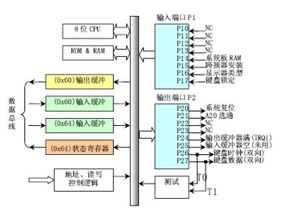

## 4 实验报告要求

从网站上下载lab1.tar.bz2后，解压得到代码目录lab1，完成实验。在实践中完成实验的各个练习。在报告中回答所有练习中提出的问题。实验报告文档命名为lab1-学生ID.odt or lab1-学生ID.txt。推荐用txt格式，即基本文本格式。对于lab1中编程任务，完成编写之后，在lab1目录下执行make handin任务，即会自动生成lab1-handin.tar.gz文件。建立一个目录，名字为lab1_result，将实验报告文档和之前生成的handin文件放在该目录下。然后用tar软件压缩打包此目录，并命名为lab1-学生ID.tar.bz2（在lab1_result的上层目录下执行“tar jcf lab1-学生ID.tar.bz2 lab1_result “即可）。最后请一定提前或按时提交到网络学堂上。

注意有“LAB1”的注释，代码中所有需要完成的地方（challenge除外）都有“LAB1”和“YOUR CODE”的注释，请在提交时特别注意保持注释，并将“YOUR CODE”替换为自己的学号，并且将所有标有对应注释的部分填上正确的代码。

## 附录“关于A20 Gate”

【参考“关于A20 Gate” http://hengch.blog.163.com/blog/static/107800672009013104623747/ 】

【参考“百度文库 激活A20地址线详解” http://wenku.baidu.com/view/d6efe68fcc22bcd126ff0c00.html】

Intel早期的8086 CPU提供了20根地址线,可寻址空间范围即0~2^20(00000H~FFFFFH)的 1MB内存空间。但8086的数据处理位宽位16位，无法直接寻址1MB内存空间，所以8086提供了段地址加偏移地址的地址转换机制。PC机的寻址结构是segment:offset，segment和offset都是16位的寄存器，最大值是0ffffh，换算成物理地址的计算方法是把segment左移4位，再加上offset，所以segment:offset所能表达的寻址空间最大应为0ffff0h + 0ffffh = 10ffefh（前面的0ffffh是segment=0ffffh并向左移动4位的结果，后面的0ffffh是可能的最大offset），这个计算出的10ffefh是多大呢？大约是1088KB，就是说，segment:offset的地址表示能力，超过了20位地址线的物理寻址能力。所以当寻址到超过1MB的内存时，会发生“回卷”（不会发生异常）。但下一代的基于Intel 80286 CPU的PC AT计算机系统提供了24根地址线，这样CPU的寻址范围变为 2^24=16M,同时也提供了保护模式，可以访问到1MB以上的内存了，此时如果遇到“寻址超过1MB”的情况，系统不会再“回卷”了，这就造成了向下不兼容。为了保持完全的向下兼容性，IBM决定在PC AT计算机系统上加个硬件逻辑，来模仿以上的回绕特征，于是出现了A20 Gate。他们的方法就是把A20地址线控制和键盘控制器的一个输出进行AND操作，这样来控制A20地址线的打开（使能）和关闭（屏蔽\禁止）。一开始时A20地址线控制是被屏蔽的（总为0），直到系统软件通过一定的IO操作去打开它（参看bootasm.S）。很显然，在实模式下要访问高端内存区，这个开关必须打开，在保护模式下，由于使用32位地址线，如果A20恒等于0，那么系统只能访问奇数兆的内存，即只能访问0--1M、2-3M、4-5M......，这显然是不行的，所以在保护模式下，这个开关也必须打开。

当A20 地址线控制禁止时，则程序就像在8086中运行，1MB以上的地是不可访问的。在保护模式下A20地址线控制是要打开的。为了使能所有地址位的寻址能力,必须向键盘控制器8042发送一个命令。键盘控制器8042将会将它的的某个输出引脚的输出置高电平，作为 A20 地址线控制的输入。一旦设置成功之后，内存将不会再被绕回(memory wrapping)，这样我们就可以寻址整个 286 的 16M 内存，或者是寻址 80386级别机器的所有 4G 内存了。 

键盘控制器8042的逻辑结构图如下所示。从软件的角度来看，如何控制8042呢？早期的PC机，控制键盘有一个单独的单片机8042，现如今这个芯片已经给集成到了其它大片子中，但其功能和使用方法还是一样，当PC机刚刚出现A20 Gate的时候，估计为节省硬件设计成本，工程师使用这个8042键盘控制器来控制A20 Gate，但A20 Gate与键盘管理没有一点关系。下面先从软件的角度简单介绍一下8042这个芯片。
 

图13 键盘控制器8042的逻辑结构图

8042键盘控制器的IO端口是0x60～0x6f，实际上IBM PC/AT使用的只有0x60和0x64两个端口（0x61、0x62和0x63用于与XT兼容目的）。8042通过这些端口给键盘控制器或键盘发送命令或读取状态。输出端口P2用于特定目的。位0（P20引脚）用于实现CPU复位操作，位1（P21引脚）用户控制A20信号线的开启与否。系统向输入缓冲（端口0x64）写入一个字节，即发送一个键盘控制器命令。可以带一个参数。参数是通过0x60端口发送的。 命令的返回值也从端口 0x60去读。8042有4个寄存器：

- 1个8-bit长的Input buffer；Write-Only；
- 1个8-bit长的Output buffer； Read-Only；
- 1个8-bit长的Status Register；Read-Only；
- 1个8-bit长的Control Register；Read/Write。

有两个端口地址：60h和64h，有关对它们的读写操作描述如下：

- 读60h端口，读output buffer 
- 写60h端口，写input buffer 
- 读64h端口，读Status Register
- 操作Control Register，首先要向64h端口写一个命令（20h为读命令，60h为写命令），然后根据命令从60h端口读出Control Register的数据或者向60h端口写入Control Register的数据（64h端口还可以接受许多其它的命令）。

Status Register的定义（要用bit 0和bit 1）：

<table>
<tr><td>bit</td><td>meaning</td></tr>
<tr><td>0</td><td>output register (60h) 中有数据</td></tr>
<tr><td>1</td><td>input register (60h/64h) 有数据</td></tr>
<tr><td>2</td><td>系统标志（上电复位后被置为0）</td></tr>
<tr><td>3</td><td>data in input register is command (1) or data (0)</td></tr>
<tr><td>4</td><td>1=keyboard enabled, 0=keyboard disabled (via switch)</td></tr>
<tr><td>5</td><td>1=transmit timeout (data transmit not complete)</td></tr>
<tr><td>6</td><td>1=receive timeout (data transmit not complete)</td></tr>
<tr><td>7</td><td>1=even parity rec'd, 0=odd parity rec'd (should be odd)</td></tr>
</table>

除了这些资源外，8042还有3个内部端口：Input Port、Outport Port和Test Port，这三个端口的操作都是通过向64h发送命令，然后在60h进行读写的方式完成，其中本文要操作的A20 Gate被定义在Output Port的bit 1上，所以有必要对Outport Port的操作及端口定义做一个说明。

- 读Output Port：向64h发送0d0h命令，然后从60h读取Output Port的内容
- 写Output Port：向64h发送0d1h命令，然后向60h写入Output Port的数据 
- 禁止键盘操作命令：向64h发送0adh 
- 打开键盘操作命令：向64h发送0aeh 

有了这些命令和知识，就可以实现操作A20 Gate来从实模式切换到保护模式了。
理论上讲，我们只要操作8042芯片的输出端口（64h）的bit 1，就可以控制A20 Gate，但实际上，当你准备向8042的输入缓冲区里写数据时，可能里面还有其它数据没有处理，所以，我们要首先禁止键盘操作，同时等待数据缓冲区中没有数据以后，才能真正地去操作8042打开或者关闭A20 Gate。打开A20 Gate的具体步骤大致如下（参考bootasm.S）：

1. 等待8042 Input buffer为空；
2. 发送Write 8042 Output Port （P2）命令到8042 Input buffer；
3. 等待8042 Input buffer为空；
4. 将8042 Output Port（P2）得到字节的第2位置1，然后写入8042 Input buffer；
